# Risklocker Whole-Project Tree

This is the project's single visual overview. Start at the centre, then follow one branch at a time: access, daily staff work, administration, backend processing, data/security, operations, or next-update candidates.

```mermaid
mindmap
  root((Risklocker quotation system))
    Purpose
      Private internal motor quotation processing
      Staff workflow
        Upload
        Check values
        Generate deterministic PDF
      No public customer self service
    Entry and identity
      Home route
        Redirects to upload
      Sign in
        Request one-time code for named employee account
        Backend SMTP relay sends confirmation code
        Verify code and create revocable server session
        Browser receives secure HttpOnly cookie
        Successful sign in opens upload
      User creation
        No public registration route
        Admin creates users
      Roles
        Staff
          Own uploads drafts history generation and trash
        Manager
          Staff records
          Staff account management
        Admin
          All records and configuration
      Sign out
        Revokes server session and expires cookie
        Returns to login
    Daily staff workflow
      Step 1 Upload quotation PDFs
        Upload one or many files
        Optional enhanced reading request
        Maximum 50 files per batch
        Backend accepts PDF files only
      Step 2 Prepare batch
        Validate name MIME magic bytes and size
        Quarantine and inspect PDF
        Run malware scan when required
        Store accepted source PDF privately
        Extract native text and layout
        Optional enhanced reading
        Find insurer and field candidates
        Create hidden extraction record
        Create editable quotation draft
        Batch result
          Ready
          Check Needed
          Cannot Read
      Step 3 Review and edit draft
        Open batch status list
        Open Review Edit screen
        Compare source PDF with extracted text
        Edit fields that need checking
        Select Risklocker template
        Select package
        Select included benefit cards and add ons
        Save reviewed draft
        Correction memory records changed values
      Step 4 Generate output
        Generate one reviewed draft
        Or generate all Ready drafts in a batch
        Requires saved review template and package
        Render deterministic HTML and CSS PDF
        Quarantine and scan generated PDF
        Create immutable version snapshot
        Download through authenticated content endpoint
      After generation
        Reopen from history
        Edit and generate a later version
        Generated versions are never overwritten
    Staff workspace
      Upload screen
        Choose files
        Review selected files
        Choose enhanced reading
      Batch screen
        View each file status and issue
        Review Edit draft
        Generate all Ready PDFs
      Review screen
        Sticky actions
        Source PDF viewer
        Extracted text
        Editable review fields
        Template package and benefit selection
        Generated version links
      History screen
        Search previous records
        Reopen draft
        Regenerate edited version
      Trash screen
        View soft deleted records
        Restore record before configured purge
    Administration
      Users and roles
        List users
        Create user
        Update user role or status
      Insurance companies
        Company category
        Detection phrases
      Templates
        Locked default motor template
        Copy before editing
        Create additional templates
        A4 template builder
          Text and typed variables
          Shapes and groups
          Runtime assets
          Benefit cards
          Packages and add ons
          Deterministic preview
      Benefits
        Configure benefit options
      Storage
        Check private storage state
        Purge expired binaries
        Start optional Microsoft archive connection
      System checks
        Database
        Required PDF packages
        Playwright and Chromium
        Malware scanner
        Private Supabase storage
        Optional enhanced reading tools
      Existing admin API capabilities
        Field aliases
        Vehicle brands and models
        Extraction settings
        Extraction detail records
    API and backend engine
      Authentication and access control
        Request code verify code current user and logout APIs
        Hashed expiring throttled login challenges
        Eight-hour rolling session and 30-day hard limit
        Account disable and Admin session revocation
        Backend role based access control
        Owner and manager record checks
      Upload service
        Batch upload API
        File validation
        Security quarantine
        Private source storage
      Extraction engine
        Native PDF reader
        Layout detection
        Candidate finder
        Conflict detection
        Draft mapper
        Enhanced reading adapters
        Resource limited sandbox
      Review service
        Draft fetch and save
        Field status tracking
        History search
        Trash restore and purge
      Template and PDF service
        Template configuration
        Asset catalog
        Deterministic HTML renderer
        PDF generator
        Generated version storage
      Content service
        Authenticated source PDF streaming
        Authenticated generated PDF streaming
        Browser byte range support
      Retention service
        Daily expiry cycle
        Metadata remains after binary expiry
    Application data
      Supabase Postgres only
        Users
        Hashed login challenges
        Revocable authentication sessions
        Insurance companies and categories
        Templates and benefit options
        Dictionaries and settings
        Batches and uploaded files
        Extraction records
        Quotation drafts
        Generated PDF versions and snapshots
        Correction memory
        Trash records
        Audit events
        Storage connection metadata
      Private Supabase Storage only
        Source PDFs
          Source path by year month batch and file ID
        Generated PDFs
          Generated path by year month draft and version
      Optional archive
        SharePoint or OneDrive
        Backend only
        Requires Microsoft Entra setup and archive worker
    Security and lifecycle rules
      Never expose service role credentials to frontend
      Never reveal provider URLs or storage keys to staff
      Never silently guess uncertain extracted values
      Never persist PDFs in repository or application server folders
      Never use AI generated final PDF layout
      Source and generated binaries
        Default storage retention is 30 days
        Expired source cannot be reconstructed
        Expired generated PDF can be generated as a new version
      Deleted records
        Default trash retention is 14 days
        Database record purge is separate from binary expiry
    Operations and quality
      Startup
        Verify Supabase Postgres connection
        Ensure private storage bucket
        Seed defaults outside production
        Start daily retention loop
      Commands
        Apply migrations
        Initialize defaults
        Create admin
        Start and stop local services
        Purge expired PDFs and trash
        Smoke test
        Refresh code map
      Automated tests
        Configuration and secure settings
        Passwordless authentication and secure sessions
        Extraction regressions
        PDF generation
        Upload hardening
        Private storage and retention
        Frontend production build
    Current next update candidates
      Required consistency fixes
        Align upload screen with backend policy
        Screen currently advertises image formats
        Backend currently accepts PDFs only
        Screen advertises 50 MB files
        Backend default limit is 1 MB
      Engineering hardening work
        Wire or remove inactive configuration flags
          Enhanced reading enabled
          Strict no guessing
          Auto download generated PDF
        Replace untyped mutable API payloads with explicit schemas
        Expand HTTP route and RBAC integration tests beyond authentication
        Add browser workflow tests
        Add repository CI workflow
        Verify deployment rate limiting and security headers
      UI and product decisions
        Decide whether to add admin screens
        Dictionaries API exists without a dedicated current page
        Extraction settings API exists without a dedicated current page
        Improve role focused navigation if needed
          Backend already enforces permissions
          Frontend navigation currently presents Admin entry in shared shell
      Optional archive work
        Complete Microsoft archive only when required
        Requires Entra credentials
        Requires checksum verified backend archive worker
    Documentation brain
      Start Here
        Read before repository work
        Routes prompts to the smallest necessary documents
      Memory
        Short current project snapshot
        Replace stale facts rather than append activity logs
      Topic documents
        Business rules
        Architecture
        API contract
        Design system
        Operations
        Testing
        References
      Generated code map
        Refresh after structural or major behavior changes
```

## How to Use This Tree

- Follow `Daily staff workflow` to understand the product path in order.
- Follow `Administration` to see every current configuration capability and the APIs that do not yet have a dedicated screen.
- Follow `Current next update candidates` for verified areas that may need implementation or a product decision. Required consistency fixes and engineering hardening work are open; UI and optional-archive branches require scope decisions before implementation.
- Follow `API and backend engine`, `Application data`, and `Security and lifecycle rules` before changing technical behavior.
- Keep this tree updated whenever a workflow, role, route family, service boundary, storage rule, or integration changes.
